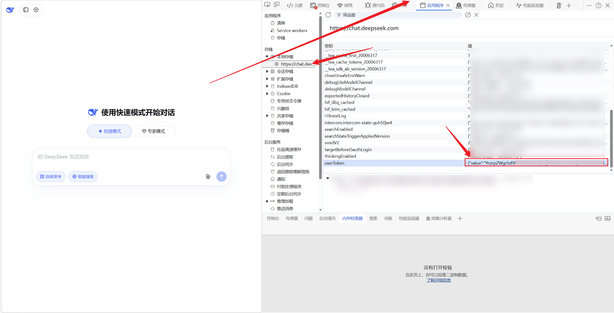
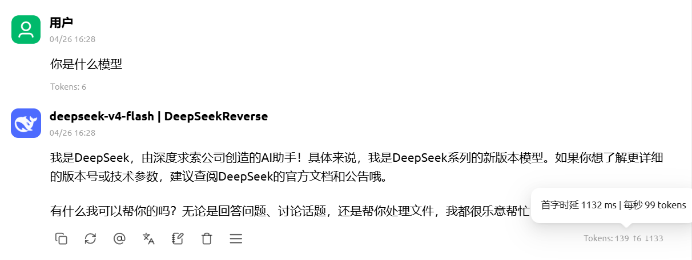
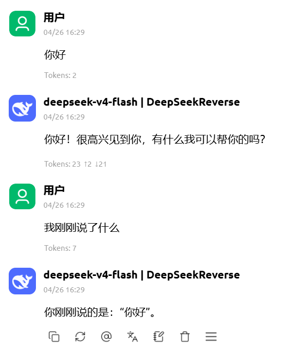
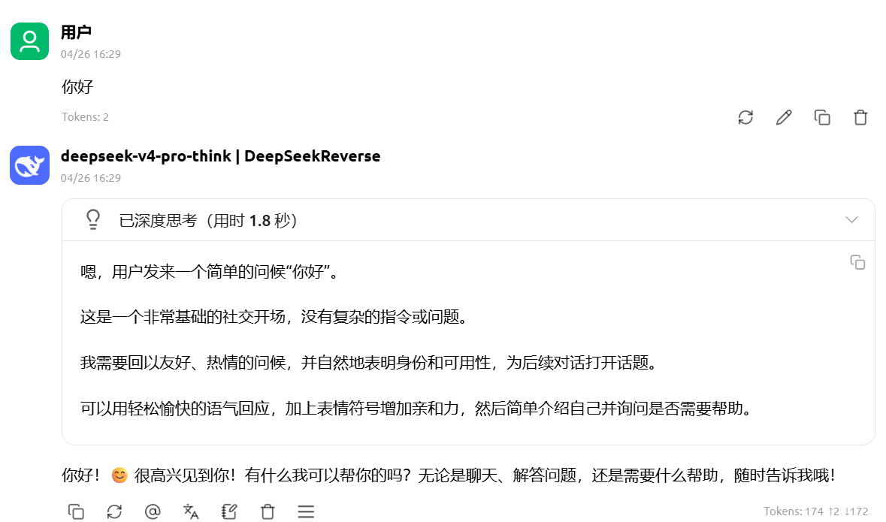

# DeepSeek AI OpenAI Compatible API

[](https://www.python.org/downloads/)
[](https://flask.palletsprojects.com/)
[](https://opensource.org/licenses/MIT)

基于 DeepSeek AI (chat.deepseek.com) 的逆向 API，提供 OpenAI 兼容接口。

## 🔗 相关项目

- [Qwen AI Reverse API](https://github.com/Wu-jiyan/qwen-ai-reverse-api) - Qwen AI 国际站 逆向 API

## ✨ 功能特性

- 🔌 **OpenAI 兼容** - 与 OpenAI SDK 完全兼容的接口
- 🚀 **流式响应** - 实时流式输出，低延迟
- 💬 **上下文支持** - 多轮对话，保持对话连贯性
- 🧠 **深度思考** - 支持 DeepSeek-R1 推理模型，展示思考过程
- 🔍 **联网搜索** - 支持 Web 搜索功能
- 🛠️ **工具调用** - 支持 Function Calling
- 🌐 **Vless 代理池** - 支持 Vless 代理和 HTTP 代理
- ⚡ **POW 计算** - 使用 WASM 高效计算 Proof of Work

## 📦 安装

### 环境要求
- Python 3.8+
- wasmtime (用于 POW 计算)

### 安装依赖

```bash
pip install -r requirements.txt
```

## 🚀 快速开始

### 1. 获取 DeepSeek Token

**方法 A: 使用登录工具**

```bash
# 单个账号登录
python -c "from deepseek_ai.account_register import login_account; login_account('your_email@example.com', 'your_password')"
```

**方法 B: 从浏览器获取**



1. 访问 https://chat.deepseek.com 并登录账号
2. 按 F12 打开浏览器开发者工具
3. 进入 **Application** → **Local Storage** → **https://chat.deepseek.com**
4. 复制 `user_token` 键的值

### 2. 配置环境变量

```bash
# 复制示例配置文件
cp .env.example .env

# 编辑 .env 文件，填写你的配置
```

### 3. 启动服务

```bash
python start_server.py
```

**启动参数：**
| 参数 | 说明 |
|------|------|
| `--host` | 监听地址（默认：0.0.0.0） |
| `--port` | 监听端口（默认：8000） |
| `--reload` | 开发模式自动重载 |

### 4. 测试 API

```bash
curl -X POST http://localhost:8000/v1/chat/completions \
  -H "Authorization: Bearer <YOUR_DEEPSEEK_TOKEN>" \
  -H "Content-Type: application/json" \
  -d '{
    "model": "deepseek-v4-flash",
    "messages": [{"role": "user", "content": "Hello"}]
  }'
```

## 🎬 DEMO 演示

### 验明正身


### 多轮对话


### 深度思考


## 📖 API 文档

### 对话补全

```http
POST /v1/chat/completions
```

**请求头**
| 参数 | 说明 |
|------|------|
| Authorization | Bearer Token，DeepSeek 的 user_token |
| Content-Type | application/json |

**请求体**
```json
{
  "model": "deepseek-v4-flash",
  "messages": [
    {"role": "user", "content": "Hello"}
  ],
  "stream": false,
  "temperature": 0.7,
  "web_search": false,
  "thinking": {"type": "enabled"}
}
```

**参数说明**
| 参数 | 类型 | 必填 | 说明 |
|------|------|------|------|
| model | string | 是 | 模型名称，见下表 |
| messages | array | 是 | 消息列表 |
| stream | boolean | 否 | 是否流式输出，默认 false |
| temperature | float | 否 | 温度参数，默认 null |
| web_search | boolean | 否 | 是否启用联网搜索 |
| thinking | object | 否 | 思考模式 {"type": "enabled"} |
| reasoning_effort | string | 否 | 推理强度 low/medium/high |

### 获取模型列表

```http
GET /v1/models
```

## 🎯 支持模型

| 模型 | 描述 | model_type | thinking_enabled |
|------|------|------------|------------------|
| deepseek-v4-flash | 快速响应模型 | default | false |
| deepseek-v4-flash-think | Flash 思考模式 | default | true |
| deepseek-v4-flash-fast | Flash 快速模式 | default | false |
| deepseek-v4-pro | 专业版模型 | expert | true |
| deepseek-v4-pro-think | Pro 思考模式 | expert | true |
| deepseek-v4-pro-fast | Pro 快速模式 | expert | false |

**模型后缀说明：**
- `-think`: 启用思考模式
- `-fast`: 禁用思考模式
- 无后缀: 根据模型类型自动选择（flash 默认不思考，pro 默认思考）

## 💻 使用示例

### Python

```python
import requests

url = "http://localhost:8000/v1/chat/completions"
headers = {"Authorization": "Bearer YOUR_DEEPSEEK_TOKEN"}

data = {
    "model": "deepseek-v4-flash",
    "messages": [{"role": "user", "content": "Hello"}]
}

response = requests.post(url, headers=headers, json=data)
print(response.json())
```

### 流式响应

```python
import requests

url = "http://localhost:8000/v1/chat/completions"
headers = {"Authorization": "Bearer YOUR_DEEPSEEK_TOKEN"}

data = {
    "model": "deepseek-v4-flash",
    "messages": [{"role": "user", "content": "Hello"}],
    "stream": True
}

response = requests.post(url, headers=headers, json=data, stream=True)
for line in response.iter_lines():
    if line:
        print(line.decode('utf-8'))
```

### 深度思考模式

```python
data = {
    "model": "deepseek-v4-pro-think",
    "messages": [{"role": "user", "content": "Solve this math problem: 2x + 5 = 13"}]
}
```

或使用 API 参数：

```python
data = {
    "model": "deepseek-v4-pro",
    "messages": [{"role": "user", "content": "Solve this math problem"}],
    "thinking": {"type": "enabled"},
    "reasoning_effort": "high"
}
```

### 联网搜索

```python
data = {
    "model": "deepseek-v4-pro",
    "messages": [{"role": "user", "content": "What's the weather today?"}],
    "web_search": True
}
```

### OpenAI SDK

```python
from openai import OpenAI

client = OpenAI(
    base_url="http://localhost:8000/v1",
    api_key="YOUR_DEEPSEEK_TOKEN"
)

response = client.chat.completions.create(
    model="deepseek-v4-flash",
    messages=[{"role": "user", "content": "Hello"}]
)

print(response.choices[0].message.content)
```

## 🌐 代理配置

### HTTP 代理

在 `.env` 文件中设置：

```bash
HTTP_PROXY=http://proxy.example.com:8080
HTTPS_PROXY=http://proxy.example.com:8080
```

### Vless 代理

```bash
VLESS_PROXIES=vless://uuid@host:port?security=tls&type=ws&host=host&path=/path#name
```

## 🔧 配置选项

### 环境变量

| 变量名 | 说明 | 默认值 |
|--------|------|--------|
| `PORT` | 服务器端口 | 8000 |
| `HOST` | 服务器地址 | 0.0.0.0 |
| `AUTO_DELETE_SESSION` | 自动删除会话 | false |
| `HTTP_PROXY` | HTTP 代理 | - |
| `HTTPS_PROXY` | HTTPS 代理 | - |
| `VLESS_PROXIES` | Vless 代理列表 | - |

## 📁 项目结构

```
deepseek-ai-reverse-api/
├── deepseek_ai/              # Python SDK
│   ├── __init__.py
│   ├── adapter.py            # API 适配器
│   ├── client.py             # OpenAI 兼容客户端
│   ├── stream_handler.py     # 流处理
│   ├── tool_parser.py        # 工具解析
│   ├── pow_solver.py         # POW 计算 (WASM)
│   ├── account_register.py   # 账号注册登录
│   ├── vless_proxy.py        # Vless 代理池
│   ├── subscription.py       # 订阅管理
│   ├── node_storage.py       # 节点存储
│   ├── node_tester.py        # 节点测试
│   └── proxy_adapter.py      # 代理适配器
├── server.py                 # 主 API 服务器
├── start_server.py           # 启动脚本
├── requirements.txt          # 依赖
├── .env.example              # 环境变量示例
├── .gitignore                # Git 忽略配置
├── LICENSE                   # 许可证
└── README.md                 # 本文档
```

## ⚠️ 免责声明

本项目是对 DeepSeek AI 网页版 API 的逆向工程，仅供学习研究使用。请遵守 DeepSeek AI 的服务条款，不要用于商业用途或大规模请求。

## 📄 License

[MIT License](LICENSE)
